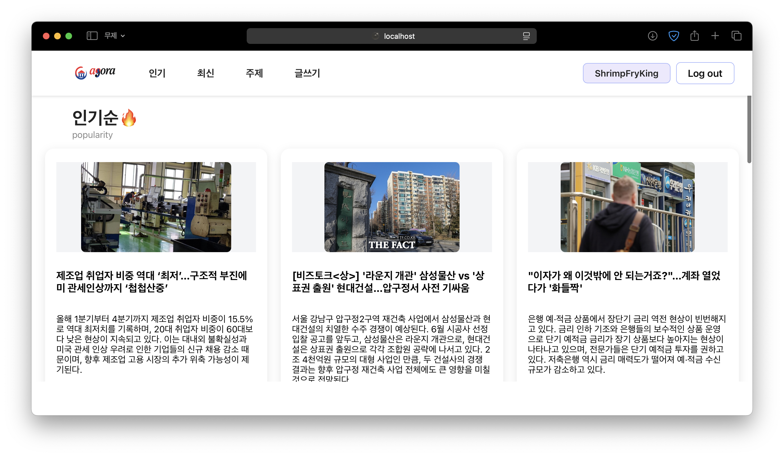
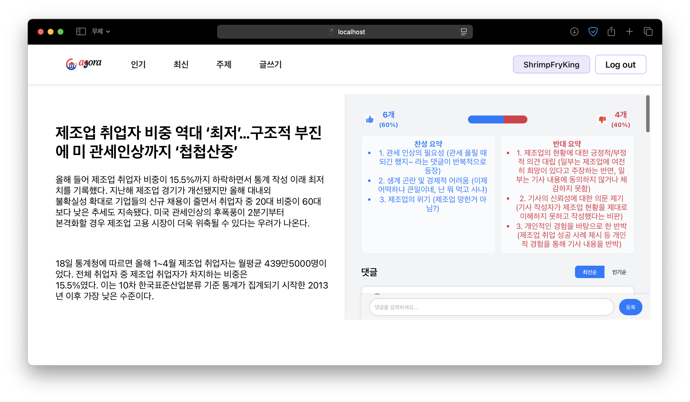

# Agora
## 🚀 주요 화면 및 기능 소개

- **메인 페이지**: 인기 뉴스, 최신 뉴스, 주제별 뉴스(정치/경제/과학/기타) 목록 제공
- **뉴스 상세**: AI가 요약한 찬성/반대 대표 의견, 댓글 토론, 투표(찬성/반대) 기능
- **댓글 시스템**: 대댓글, 댓글 추천(Like), 최신순/인기순 정렬 지원
- **뉴스 등록**: 신뢰할 수 있는 뉴스 URL을 직접 등록, 주제 선택
- **회원가입/로그인**: 간편한 인증 및 사용자별 활동 관리


## 📸 주요 화면 예시







## 📌 프로젝트 개요

- **프로젝트**: Agora
- **프로젝트 팀명**: ShrimpFryKing
- **개발 인원**: 총 5명(공호준, 김민경, 노장한, 유선재, 이호준)
- **주요 기능**: 에코 체임버 문제를 해결하기 위해 자유로운 토론과 다양한 정보 접근이 가능한 웹사이트 ‘아고라’를 만들었습니다. 자연스러운 반대 의견 접근을 위해 AI가 뉴스 댓글을 분석해 대표 찬성 반대 의견을 요약해 보여주고, 다양한 출처의 뉴스를 함께 제공해 자연스럽게 여러 관점을 접할 수 있도록 했습니다. 누구나 출처가 명확한 뉴스를 공유하고, 토론에 참여하거나 읽기만 해도 균형 잡힌 시각을 얻을 수 있는 열린 공간입니다.
- **사용 기술**: GeminiAPI, fastAPI, sqlite3, REACT

## 🦐 ShrimpFryKing

Agora는 웹 기반의 응용 애플리케이션으로, Python과 JavaScript를 사용하여 백엔드와 프론트엔드를 구현한 팀 프로젝트입니다.
본 저장소는 프로젝트 전체 코드를 포함하고 있으며, 프레젠테이션 자료도 함께 제공됩니다.

## 📁 폴더 구조

```
ShrimpFryKing/
├── README.md                # 프로젝트 설명 및 안내 파일
├── backend/                 # 백엔드 서버 코드 (FastAPI 기반)
│   ├── routers/             # FastAPI 라우터 모음
│   ├── crawling/            # url 기반 웹 크롤링 신규 글 추가
│   ├── db/                  # sqlite3 데이터베이스 입출력
│   ├── categorizer/         # GeminiAPI 분류
│   ├── services/            # 라우터에서 호출할 함수
│   ├── utils/               # util functions
│   └── ...                  # 기타 백엔드 관련 파일
├── frontend/                # 프론트엔드 애플리케이션 (React 기반)
│   ├── src/                 # React 소스 코드
│   ├── public/              # 정적 파일 및 HTML 템플릿
│   └── ...                  # 기타 프론트엔드 관련 파일
├── present...yKing.pdf      # 프로젝트 발표 자료 (PDF)
├── common.json              # 공통 설정 또는 데이터 파일
└── package-lock.json
```

## 🛠 사용 기술

### Backend (Auto use with uv)
- Python
- fastapi
- beautifulsoup4
- google-generativeai

### Frontend
- HTML5
- CSS3
- JavaScript
- react


## 🖥️ 설치 및 실행 방법

```bash
# 프론트엔드 실행
cd frontend
npm ci
npm run start

# 백엔드 실행
cd backend
uv sync
uv run fastapi dev
```